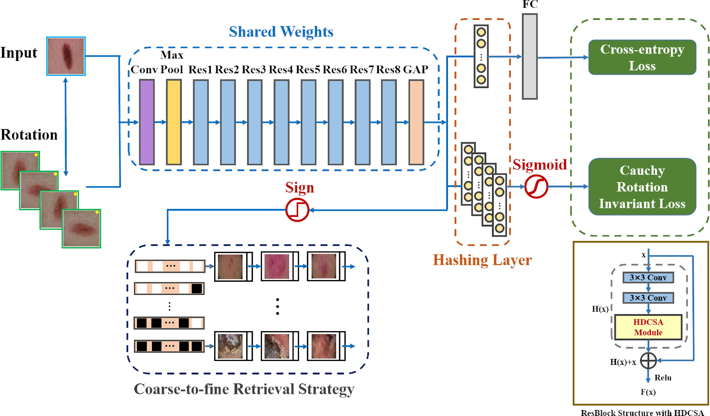

<h1>ECL: Class-Enhancement Contrastive Learning for Long-tailed Skin Lesion Classification</h1>

### Share us a :star: if this repo does help

This is the implementation of *[Dermoscopic image retrieval based on rotation-invariance deep hashing](https://doi.org/10.1016/j.media.2021.102301) (Accepted by MedIA 2022)*. If you encounter any question, please feel free to contact us. You can create an issue or just send email to me zhangyilan@buaa.edu.com. Also welcome for any idea exchange and discussion.

### Abstract

Dermoscopic image retrieval technology can provide dermatologists with valuable information such as similar confirmed skin disease cases and diagnosis reports to assist doctors in their diagnosis. In this study, we design a dermoscopic image retrieval algorithm using convolutional neural networks (CNNs) and hash coding. A hybrid dilated convolution spatial attention module is proposed, which can focus on important information and suppress irrelevant information based on the complex morphological characteristics of dermoscopic images. Furthermore, we also propose a Cauchy rotation invariance loss function in view of the skin lesion target without the main direction. This function constrains CNNs to learn output differences in samples from different angles and to make CNNs obtain a certain rotation invariance. Extensive experiments are conducted on dermoscopic image datasets to verify the effectiveness and versatility of the proposed module, algorithm, and loss function. Experiment results show that the rotation-invariance deep hashing network with the proposed spatial attention module obtains better performance on the task of dermoscopic image retrieval.

### Updates

[**29/09/2021**] Code is public.

### Citation
Please cite our paper in your publications if our work helps your research. BibTeX reference is as follows. 

@article{ZHANG2021102301, 
title = {Dermoscopic image retrieval based on rotation-invariance deep hashing}, 
journal = {Medical Image Analysis}, 
pages = {102301}, 
year = {2021}, 
issn = {1361-8415}, 
doi = {https://doi.org/10.1016/j.media.2021.102301}, 
url = {https://www.sciencedirect.com/science/article/pii/S1361841521003467}, 
author = {Yilan Zhang and Fengying Xie and Xuedong Song and Yushan Zheng and Jie Liu and Juncheng Wang}, 
keywords = {Deep hashing, Convolutional neural network, Image retrieval, Attention mechanism, Cauchy distribution}. 
}

### License
This project is released under the [MIT license](LICENSE).